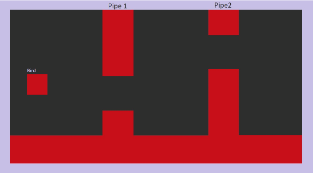

# 🐦 Flappy Bird - VHDL Project 🎮

This repository contains the implementation of the **Flappy Bird** game using **VHDL**, designed for the Nexys 4 board. The game replicates the classic gameplay experience, using hardware resources like VGA output for graphics and an SSD display for scoring.

---

## 📜 Table of Contents
- [🐦 Flappy Bird - VHDL Project 🎮](#-flappy-bird---vhdl-project-)
  - [📜 Table of Contents](#-table-of-contents)
  - [🎯 Objective](#-objective)
  - [🛠️ Features](#️-features)
  - [🧩 How It Works](#-how-it-works)
  - [⚙️ Design Overview](#️-design-overview)
    - [🖥️ Modules](#️-modules)
    - [🔄 Flowchart](#-flowchart)
    - [💡 Technical Justifications](#-technical-justifications)
  - [🚀 Getting Started](#-getting-started)
    - [Prerequisites](#prerequisites)
    - [Steps to Run](#steps-to-run)
  - [📷 Screenshots](#-screenshots)
 

---

## 🎯 Objective
The purpose of this project is to recreate the **Flappy Bird** game with a minimalist design using VHDL, focusing on hardware-level implementation. The player must navigate a bird (represented by a square) through gaps in vertical pipes while avoiding collisions. The game offers:
- **Real-time gameplay** controlled by a button.
- **High score tracking** using the SSD display.
- **Graphical output** via VGA.

---

## 🛠️ Features
- **🎮 Playable Game**: Interactive gameplay with a button controlling the bird's flight.
- **📺 VGA Output**: Real-time rendering of the bird, pipes, and background.
- **📊 Score Display**: Player's score is updated dynamically on the SSD.
- **📏 Configurable Parameters**: Game speed and pipe gap settings.

---

## 🧩 How It Works
1. **Gameplay Mechanics**:
   - **Button Input**: The bird (a square) jumps upward when the button is pressed. When the button is released, gravity causes the bird to descend.
   - **Pipes**: Two repeating pipes move from right to left, creating gaps for the bird to pass through. Points are awarded for each successful pass.
   - **Collision Detection**: The game ends if the bird collides with a pipe, the ground, or the upper boundary.

2. **Game States**:
   - **Waiting State**: The game waits for the player to start by pressing the button.
   - **Play State**: Pipes move, and the bird navigates through gaps. Score increases with each successful pass.
   - **Game Over State**: The game resets, and the score is set back to 0 after a collision.

---

## ⚙️ Design Overview
### 🖥️ Modules
- **MAIN**: Manages synchronization, gameplay logic, collision detection, and scoring.
- **VGA**: Handles VGA signal generation and pixel rendering.
- **FLY**: Simulates the bird's motion based on button input and gravity.
- **FREQUENCY DIVIDER**: Generates lower frequency clock signals for smooth game operation.
- **DISPLAY**: Assigns colors to the bird, pipes, grass, and background.
- **PIPES**: Simulates moving pipes and updates their position dynamically.
- **CRASH**: Detects collisions between the bird and obstacles, triggering game over.
- **SSD**: Controls the SSD to display the current score.

### 🔄 Flowchart
- **Game Logic**:
  - **WAITING STATE**: Waits for player input to start.
  - **PLAY STATE**: Manages bird movement, pipe rendering, scoring, and collision detection.
  - **GAME OVER**: Resets the game after a collision.

### 💡 Technical Justifications
The minimalist design was inspired by the classic **Flappy Bird** game. The project replicates its core mechanics while optimizing for hardware implementation:
- A simple square represents the bird.
- Two repeating pipes simplify the design while retaining gameplay dynamics.
- The central button on the Nexys 4 board controls the bird's motion.

---

## 🚀 Getting Started
### Prerequisites
- Nexys 4 board or compatible FPGA hardware.
- VHDL development tools (e.g., Xilinx Vivado).

### Steps to Run
1. Clone the repository:
   ```bash
   git clone https://github.com/ralucaand03/Flappy-Bird---VHDL.git
2. Set Up Environment:
Open the project in a VHDL tool like Xilinx Vivado or ModelSim.
Import the VHDL files from the /src folder.
Program the FPGA Board:
3. Synthesize and load the design onto a Nexys 4 board.
Connect a VGA monitor for display.
Start the Game:
4. Press the center button to play.
Use the same button to control the bird.
arduino
Copiază
Editează
---
## 📷 Screenshots
🎨 **Gameplay Preview**  
Here’s a snapshot of the Flappy Bird game in action:  



---


⭐ **Don't forget to star the repository if you enjoyed it!** 🌟
